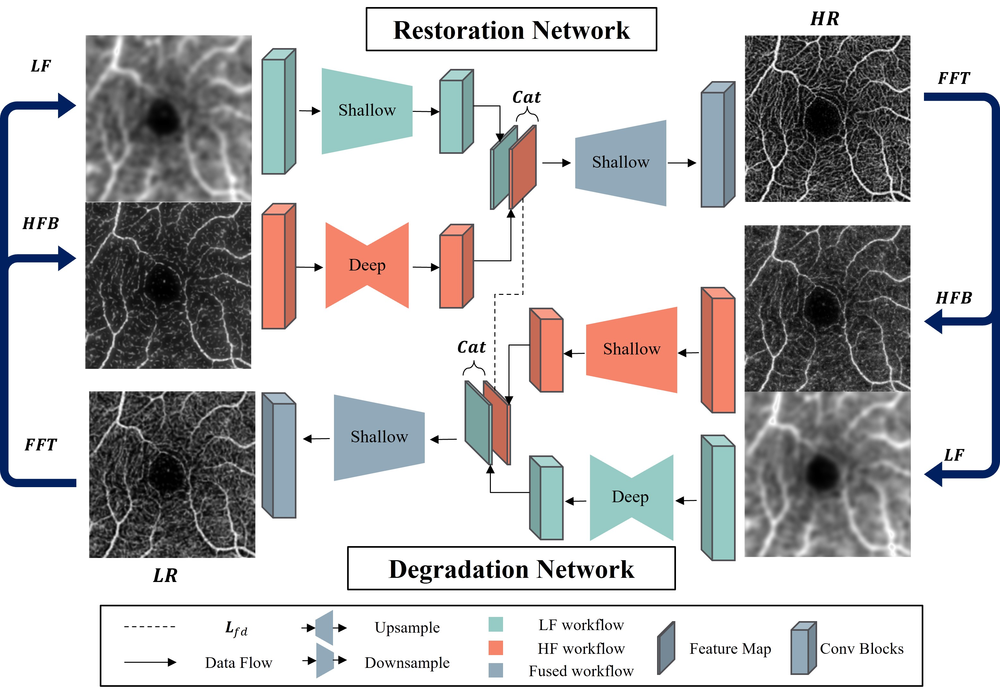

# Frequency-Aware Inverse-Consistent Deep Learning for OCT-Angiogram Super-Resolution

This is the official PyTorch implementation of "[Frequency-Aware Inverse-Consistent Deep Learning for OCT-Angiogram Super-Resolution](https://link.springer.com/chapter/10.1007/978-3-031-16434-7_62)", MICCAI 2022.  
Please follow `main.ipynb` to execute the code.  

## Illustration of our method:  

> Our generators  
  
  
> Our Discriminators  
  

## Access to the pretrained model:  
Create a folder `pre_trained` and put pretrained model in it. Download pretrained model [here](https://hkustconnect-my.sharepoint.com/:f:/g/personal/wzhangbu_connect_ust_hk/Ev6yRUKDKytKmWjZwxWaML4BqodCQjg6U9EntuPnjztyLw?e=1crfOa).  
